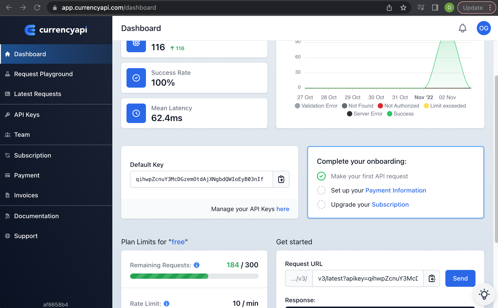

# IB Machine Learning Studio


# IB Flow Editor


# Code examples in Refiner

## Date Clean up
```
format_Date(Date)
format_date(replace(replace(replace(replace(replace(replace(Due__Date,'Due',''),'by ',''),'than ',''),' to',''),'202 1','2021'),'J a','Ja'))
```

## Calling a function
```
my_test_udf_date_diff(Clean_Date,Clean_Due_Date)
my_test_udf(Clean_Amount)
```

## IF examples
```
if(Days_Between == '', echo('True'), if(int(Days_Between) < 14, echo('True'), echo('False')))
```

## Cleaning of Input Examples
```
replace(replace(trim(clean(Amount),'$'),',',''),' ','')
```

## Examples of function calling API in the refiner scripts directory
```
from ib.market.koala import *
import sys
import requests
import json

@export

def my_test_udf(some_value):
  '''
  Cleand the data for $ and spaces and commas
  '''

  clean1=some_value.replace('$','')
  clean2=clean1.replace(' ','')
  clean3=clean2.replace(',','')

  url = 'https://api.currencyapi.com/v3/latest?apikey=qihwpZcnuY3McDGzemYOUR_KEY_HEREIoEyB03nIf&currencies=EUR'
  response = requests.get(url)
  data = response.json()

  x1=data['data']['EUR']['value']
  x5=float(clean3)*float(x1)
 
  output_value = str(round(x5 , 2))
  return output_value
```

## Examples of function date conversion in the refiner scripts directory
```
from ib.market.koala import *
import sys
import requests
import json
from datetime import datetime

@export

def my_test_udf_date_diff(some_value1 , some_value2):

  d1 = datetime.strptime(some_value1, "%m/%d/%Y")
  d2 = datetime.strptime(some_value2, "%m/%d/%Y")
  delta = d2 - d1
 
  output_value = delta.days
  return output_value
```

# Imvrovements

```
1) Subscribe to a better API call
    - with out limits for number of calls per day 
    - with out limits for the number of calls per second
2) Change the UDF to only call the API call for the currency conversion once 
    - Idea: call API for the v ery first row and use the value for the rest of the rows 
      If the sheet has 20,000 items then the API call would not be called 20,000 time, 
      but only once and used for the other 19,999 rows
```

